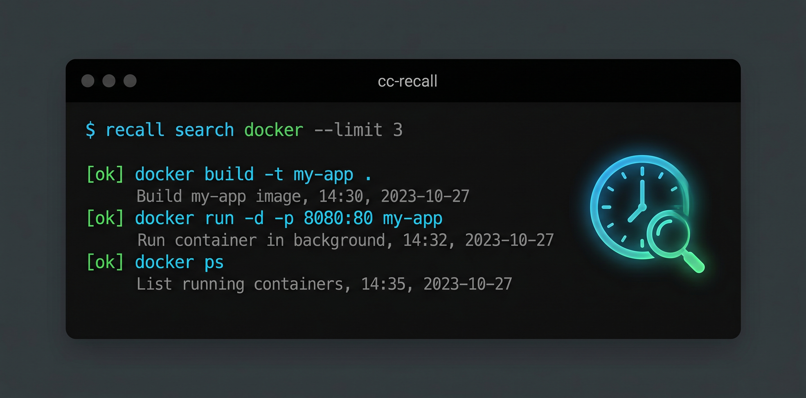

<p align="center">
  
</p>

# recall

[](https://github.com/yqdaddy/cc-recall/actions/workflows/ci.yml)
[](https://codecov.io/gh/yqdaddy/cc-recall)
[](https://opensource.org/licenses/MIT)
[](https://bun.sh)
[](https://www.typescriptlang.org/)

**[English](README.md)** | **[中文](README_CN.md)**

**recall** is a CLI tool that indexes your Claude Code sessions and lets you search bash commands and conversation content across all your past sessions.

```
"What was that docker command I ran last week?"
"What did we discuss about the database schema?"
```

```bash
$ recall search docker --limit 4

[ok] docker build --no-cache --platform linux/amd64 -t myapp:latest .
     Build production image
     1/15/2026, 3:42 PM | ~/projects/myapp

[ok] docker run --rm myapp:test npm run test
     Run tests in container
     1/15/2026, 3:45 PM | ~/projects/myapp

[ok] docker compose up -d
     Start development environment
     1/14/2026, 10:20 AM | ~/projects/myapp

[ok] docker push registry.example.com/myapp:latest
     Push to registry
     1/15/2026, 4:00 PM | ~/projects/myapp
```

```bash
$ recall chat search "database schema"

[text]
  The users table needs a created_at timestamp column. Let me add that now.
  1/10/2026, 2:30 PM | ~/projects/myapp | session: abc12345...

[thinking]
  The migration should handle existing rows by setting a default value...
  1/10/2026, 2:31 PM | ~/projects/myapp | session: abc12345...

2 messages
```

Claude Code stores every bash command and conversation message in session files at `~/.claude/projects/`. **recall** indexes these into a searchable SQLite database so you can find that command from last week, recall decisions from past sessions, and avoid repeating mistakes.

## Features

- **Command search** - Find bash commands by substring or regex, ranked by frecency
- **Conversation search** - Search assistant text and thinking blocks across sessions  
- **Session timeline** - View complete session history with messages and commands
- **Smart ranking** - Frecency algorithm surfaces frequently-used and recent commands
- **Match highlighting** - Search patterns highlighted in terminal output
- **Auto-sync** - Index updates automatically before each search
- **Candidate extraction** - Identify high-value content for knowledge systems

## Install

```bash
curl -fsSL https://raw.githubusercontent.com/yqdaddy/cc-recall/main/install.sh | bash
```

Or with Bun:

```bash
bun add -g cc-recall
```

<details>
<summary>Other options</summary>

**Manual download**: Get binaries from [releases](https://github.com/yqdaddy/cc-recall/releases)

**From source**:

```bash
git clone https://github.com/yqdaddy/cc-recall
cd cc-recall
bun install && bun run build
```

</details>

## Usage

### Command Search

```bash
# Search for commands containing "docker"
recall search docker

# Use regex patterns
recall search "git commit.*fix" --regex

# Filter by project directory
recall search npm --cwd ~/projects/myapp

# Filter by current directory
recall search npm --here

# Sort by time instead of frecency
recall search npm --sort time

# List recent commands
recall list
recall list --limit 50

# List commands from current project only  
recall list --here

# Manually sync (usually automatic)
recall sync
recall sync --force  # Re-index everything
```

### Conversation Search

```bash
# Search conversation content
recall chat search "deployment"

# Search only thinking blocks
recall chat search "architecture" --type thinking

# Search all content types
recall chat search "error" --type all

# View a full session timeline
recall chat session <session_id>
```

### Candidate Extraction

```bash
# Extract high-value content for knowledge ingestion
recall ingest --candidates

# Filter by session
recall ingest --candidates --session <session_id>

# Set minimum value score threshold
recall ingest --candidates --min-score 70

# Output as JSON (for scripts/hooks)
recall ingest --candidates --format json
```

## Commands

### `recall search <pattern>`

Search command history by substring or regex.

| Flag                | Description                           |
| ------------------- | ------------------------------------- |
| `--regex`, `-r`     | Treat pattern as regular expression   |
| `--cwd <path>`      | Filter by working directory           |
| `--here`, `-H`      | Filter by current directory           |
| `--limit`, `-n <N>` | Limit number of results               |
| `--sort <mode>`     | Sort by: `frecency` (default), `time` |
| `--no-sync`         | Skip auto-sync before searching       |

### `recall list`

Show recent commands, sorted by frecency by default.

| Flag                | Description                           |
| ------------------- | ------------------------------------- |
| `--limit`, `-n <N>` | Number of commands (default: 20)      |
| `--here`, `-H`      | Filter by current directory           |
| `--sort <mode>`     | Sort by: `frecency` (default), `time` |
| `--no-sync`         | Skip auto-sync before listing         |

### `recall chat search <pattern>`

Search conversation content (text, thinking, tool interactions).

| Flag            | Description                                         |
| --------------- | --------------------------------------------------- |
| `--type <type>` | Filter by: `text`, `thinking`, `all` (default: all) |
| `--cwd <path>`  | Filter by working directory                         |

### `recall chat session <session_id>`

View a complete session timeline with all messages and commands.

### `recall ingest --candidates`

Extract high-value content candidates for knowledge ingestion.

| Flag                | Description                             |
| ------------------- | --------------------------------------- |
| `--session <id>`    | Filter by session ID                    |
| `--min-score <N>`   | Minimum value score (default: 50)       |
| `--format <format>` | Output format: `text` (default), `json` |

### `recall sync`

Index new commands and messages from Claude Code sessions.

| Flag            | Description                        |
| --------------- | ---------------------------------- |
| `--force`, `-f` | Re-index all sessions from scratch |

## Ranking Algorithm

Commands are ranked by **frecency** (frequency + recency):

```
score = (1 + log10(frequency)) × recencyWeight
```

- **Frequency**: Logarithmic scaling so popular commands don't dominate
- **Recency**: Time-decay weights (4h=100, 24h=70, 7d=50, 30d=30)

Commands you run often AND recently appear at the top. Use `--sort time` for simple timestamp ordering.

## Value Scoring

Candidates are scored (0-100) based on:

- **Content type**: Thinking blocks score higher (70 base)
- **Word count**: Longer content scores higher (up to +30)
- **Keyword patterns**: Contains "solve|fix|implement|design|error|important" (+15)

## How It Works

Claude Code stores conversation data in `~/.claude/projects/`. Each session is a JSONL file.

**recall** scans these files and extracts:

- **Bash tool invocations** → `commands` table
- **Assistant text/thinking** → `messages` table
- **High-value content** → `candidates` table

All data stored locally in SQLite at `~/.cc-recall/history.db`.

**Auto-sync**: `search` and `list` automatically sync before returning results. Use `--no-sync` for faster queries.

**Privacy**: Read-only and local-only. Never modifies Claude session files. No data sent anywhere.

## Data Model

### Commands Table

| Field         | Description               |
| ------------- | ------------------------- |
| `command`     | The bash command executed |
| `description` | What Claude said it does  |
| `cwd`         | Working directory         |
| `timestamp`   | When executed             |
| `is_error`    | Whether command failed    |
| `stdout`      | Command output            |
| `stderr`      | Error output              |
| `session_id`  | Source session            |

### Messages Table

| Field          | Description                                   |
| -------------- | --------------------------------------------- |
| `uuid`         | Unique message ID                             |
| `session_id`   | Source session                                |
| `type`         | `user` or `assistant`                         |
| `content_type` | `text`, `thinking`, `tool_use`, `tool_result` |
| `content`      | Message content                               |
| `timestamp`    | When sent                                     |
| `cwd`          | Working directory context                     |

### Candidates Table

| Field          | Description           |
| -------------- | --------------------- |
| `session_id`   | Source session        |
| `content_type` | Type of content       |
| `content`      | Candidate content     |
| `value_score`  | Quality score (0-100) |
| `timestamp`    | When extracted        |

## For AI Agents

Run `recall onboard` to add documentation to `~/.claude/CLAUDE.md`:

```bash
recall onboard
```

This adds instructions for `recall search`, `recall list`, and `recall chat search`.

### When to use `recall`

- "What was that command I/you ran?"
- "Find commands from previous session"
- "What did we discuss about X?"
- "Recall decisions from past sessions"

### When NOT to use `recall`

- Finding files by name → use `Glob`
- Searching file contents → use `Grep`
- Recent conversation → already in context

## SessionEnd Hook Integration

Use `recall ingest --candidates --format json` in Claude Code's SessionEnd hook:

```bash
#!/bin/bash
SESSION_ID="${CLAUDE_SESSION_ID:-}"
recall ingest --candidates --session "$SESSION_ID" --min-score 50 --format json
```

Output format:

```json
{
  "hookSpecificOutput": {
    "hookEventName": "RecallCandidates",
    "candidates": [
      {
        "type": "thinking",
        "content": "...",
        "score": 75,
        "session": "..."
      }
    ]
  }
}
```

## Development

```bash
bun install
bun run src/index.ts search docker
bun run src/index.ts chat search "deployment"
bun test
bun test --coverage
bun run build
```

## About the name

**recall** - Claude Code history recall. Search and retrieve commands and conversations from your past sessions.

---

MIT License